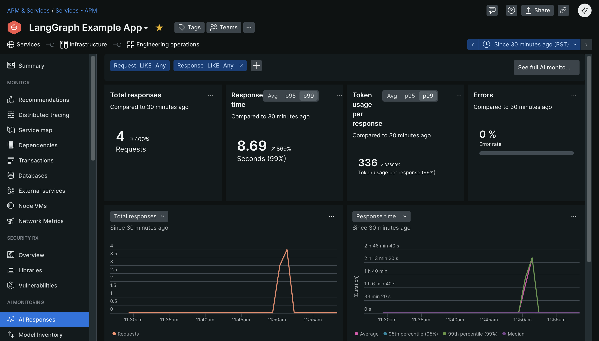
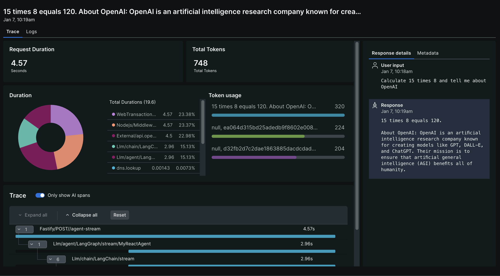

# LangGraph with OpenAI Example

This example demonstrates how to use LangGraph with OpenAI and New Relic's AI monitoring capabilities.

Note: Only for Node v20+

## Features

- **Agent with Tools**: Autonomous agent that can use calculator, weather, and search tools
- **Simple Chatbot**: Basic conversational workflow using LangGraph
- **Multi-tool Support**: Agent can call multiple tools in a single interaction
- **Streaming Responses**: View agent execution steps in real-time
- **Feedback Collection**: Record user feedback with trace correlation
- **New Relic AI Monitoring**: Complete observability for LLM applications

## Setup

1. Install dependencies:

```bash
npm install
```

2. Create a `.env` file based on `env.example`:

```bash
cp env.example .env
```

3. Add your API keys to the `.env` file:
   - `NEW_RELIC_LICENSE_KEY`: Your New Relic license key
   - `OPENAI_API_KEY`: Your OpenAI API key

## Running the Application

Start with New Relic monitoring:

```bash
npm start
```

Start without New Relic (for testing):

```bash
npm run start:no-agent
```

Start in debug mode:

```bash
npm run start:debug
```

## Testing with curl

### Agent with tools:

```bash
curl -X POST http://localhost:3000/agent \
  -H "Content-Type: application/json" \
  -d '{"message": "What is 144 divided by 12?"}'
```

### Multi-tool agent:

```bash
curl -X POST http://localhost:3000/agent-multi \
  -H "Content-Type: application/json" \
  -d '{"message": "What is the weather in Tokyo and what is 50 minus 23?"}'
```

### Simple chatbot:

```bash
curl -X POST http://localhost:3000/chatbot \
  -H "Content-Type: application/json" \
  -d '{"message": "Tell me about artificial intelligence"}'
```

### Streaming agent:

```bash
curl -X POST http://localhost:3000/agent-stream \
  -H "Content-Type: application/json" \
  -d '{"message": "Calculate 15 times 8 and tell me about New Relic"}'
```

### Feedback endpoint:

```bash
curl -X POST http://localhost:3000/feedback \
  -H "Content-Type: application/json" \
  -d '{
    "id": "your-trace-id",
    "category": "helpful",
    "rating": 5,
    "message": "Very useful response"
  }'
```

## New Relic AI Monitoring

The application uses New Relic's AI monitoring features:

- Automatic tracking of LLM calls
- Custom attributes for conversation IDs
- Feedback recording via `recordLlmFeedbackEvent`
- Trace correlation between requests and feedback

### In the APM UI

1. Find the entity in the 'APM & Services' tab. If you did not modify the app name, it should be under the entity name of 'LangGraph Example App'.
2. Then click on 'AI Responses'.
   
3. Select a conversation underneath the 'Responses' section. Here you can see a detailed view of the LLM interactions, including the user input, final response from the AI, and other useful information.
   

## How LangGraph Works

This application demonstrates LangGraph's powerful capabilities:

### Core Concepts

1. **State Management**: Using `MessagesAnnotation` to track conversation history
2. **Nodes**: Individual processing steps (agent node, tool node)
3. **Edges**: Connections between nodes that define the workflow
4. **Conditional Edges**: Dynamic routing based on agent decisions
5. **Tools**: Functions the agent can call to perform specific tasks

### Agent Workflow

The agent uses a cyclic graph pattern:

```
START → agent → [conditional: has tool calls?]
                    ↓ YES              ↓ NO
                  tools              END
                    ↓
                  agent (loops back)
```

This allows the agent to:

1. Receive a user message
2. Decide which tools (if any) to use
3. Execute the tools
4. Incorporate tool results
5. Generate a final response

### Available Tools

- **calculator**: Performs arithmetic operations (add, subtract, multiply, divide)
- **get_weather**: Returns simulated weather data for major cities
- **search**: Provides information about specific topics

The agent autonomously decides which tools to use based on the user's question.
