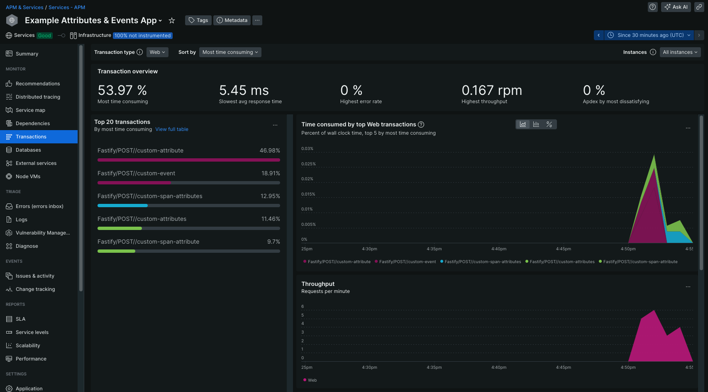
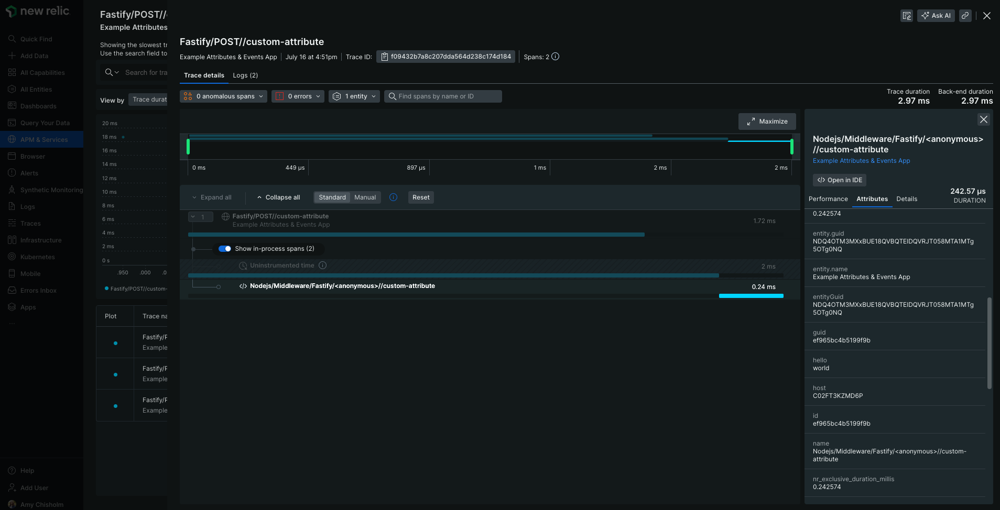
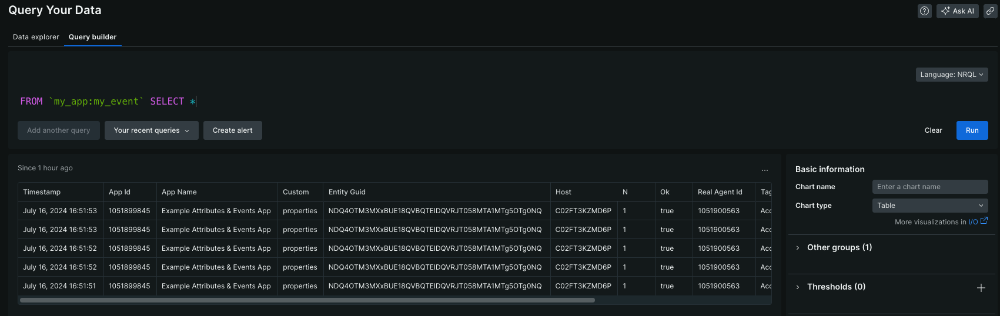
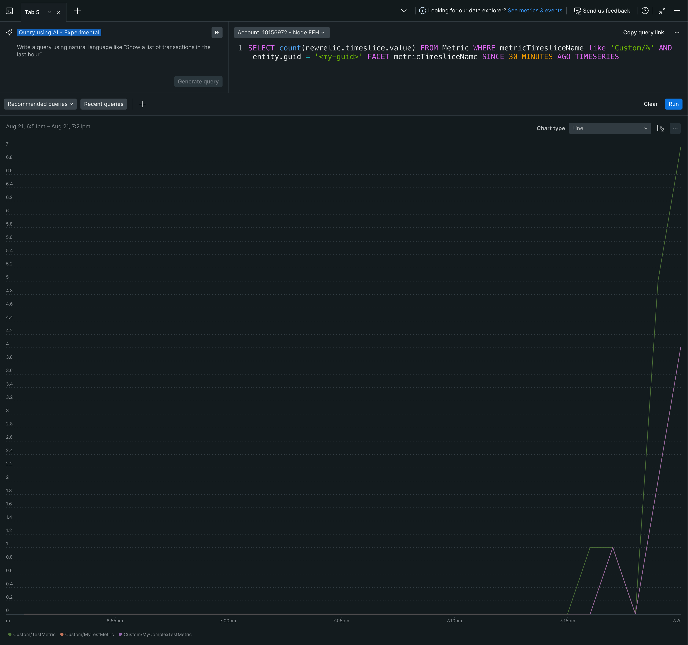

# Sample Attributes & Events Application

This example provides an application to demonstrate how to share custom attributes and events. This application is helpful for users who want to send custom attributes and events in a web framework transaction.

## Getting Started

1. Clone or fork this repository.
2. Navigate to this example's sub directory
   ```
   cd newrelic-node-examples/custom-instrumentation/attributes-events-metrics
   ```
3. Install dependencies and run application.
   ```
   npm install
   cp env.sample .env
   # Fill out `NEW_RELIC_LICENSE_KEY` in .env and save 
   # Start the application
   npm start
   ```
4. Make requests to the application. Route names include: 'custom-attribute', 'custom-attributes', 'custom-span-attribute', 'custom-span-attributes', 'custom-event', and `custom-metric`.
   ```
   curl -X POST http://localhost:3000/custom-attribute
   ```

## Exploring Telemetry

After sending a few requests, navigate to your application in APM & Services. Locate the 'Example Attributes, Events & Metrics App' service and then select Transactions on the left-side of the screen. You should see your requests in a few minutes in a similar fashion to below.



### Find your custom attributes

Select 'Distributed tracing' on the left side of your screen. Then, select a trace group with your custom attribute and select a single trace. If you expand the transaction, you should see 'Nodejs/ ... //custom-attribute'. Select 'Attributes' on the right side of your screen; scroll down the list of attributes to find your custom attribute. Notice 'hello: world' in the below example.



### Find your custom event

Navigate to 'Query Your Data' in New Relic. Enter the following query. You should now see information about your custom event(s).

```SQL
FROM `my_app:my_event` SELECT *
```



### Find your custom metrics 

Navigate to 'Query Your Data' in New Relic. Enter the following query. You should now see information about your custom event(s).

```SQL
SELECT count(newrelic.timeslice.value) 
FROM Metric 
WHERE metricTimesliceName like 'Custom/%' 
AND entity.guid = '<guid>' 
FACET metricTimesliceName 
SINCE 30 MINUTES AGO TIMESERIES
```



