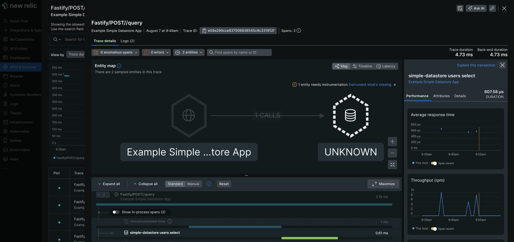

# Example instrumentation of a datastore application

This is an example application that uses the [newrelic.instrumentDatastore](https://newrelic.github.io/node-newrelic/API.html#instrumentDatastore) and associated [Datastore shim API](https://newrelic.github.io/node-newrelic/DatastoreShim.html) to instrument a hypothetical datastore. New Relic instruments only two things for datastores: queries and operations (non-queries like connect and close).

## Getting Started

1. Clone or fork this repository.
2. Navigate to this example's sub directory.

   ```
   cd newrelic-node-examples/custom-instrumentation/instrument-datastore
   ```
3. Install dependencies and run application.

   ```
   npm install
   cp env.sample .env
   # Fill out `NEW_RELIC_LICENSE_KEY` in .env and save 
   # Start the application
   npm start
   ```
4. Make requests to the application. Route names include: 'query', 'batch', and 'shutdown'.

   ```
   curl -X POST http://localhost:3000/query
   ```

   ```
   curl -X POST http://localhost:3000/batch
   ```

   ```
   curl -X POST http://localhost:3000/shutdown
   ```

## Exploring Telemetry

1. After making requests to application, wait a few minutes and go to your New Relic dashboard. Select 'APM & Services', then 'Example Simple Datastore Application', and then 'Distributed tracing'. You should see the following trace groups: `...//query`, `...//batch`, and `...//shutdown`.
2. Select the `...//query` trace group. Then select a single trace and expand it. You should see a datastore icon with "simple-datastore" next to it. After "simple-datastore", New Relic parses your query for you and describes it. In this case, we see `simple-datastore users select` which was taken from our dummy query, `SELECT * FROM users`.

   The reason we see "UNKNOWN" for our datastore is because "simple-datastore" is not a real datastore that can be instrumented by the infrastructure agent. For an actual datastore, we would select "Instrument what's missing" and follow the instructions provided.

   
3. Check out the `...//batch` and `...//shutdown` trace groups and observe the differences.

## Description

This application consists of the following files:

* `index.js`: a simple app that hosts a datastore and allows the user to make queries against it
* `simple-datastore.js`: a datastore called Simple Datastore that provides basic operations and queries
* `instrumentation.js`: all of the New Relic instrumentation is in here; the `npm start` command makes sure this module is loaded first
* `newrelic.js`: a basic, sample New Relic configuration
