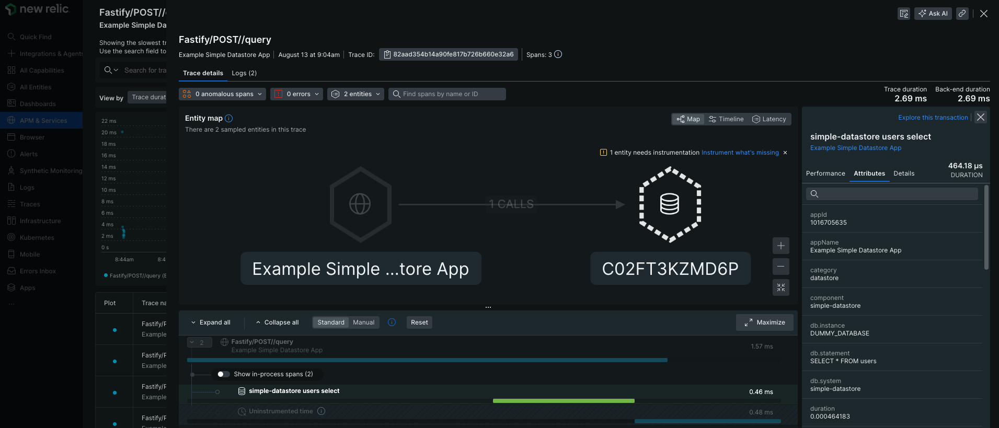

# Example instrumentation of a datastore application

This is an example application that uses the [newrelic.instrumentDatastore](https://newrelic.github.io/node-newrelic/API.html#instrumentDatastore) and associated [Datastore shim API](https://newrelic.github.io/node-newrelic/DatastoreShim.html) to instrument a hypothetical datastore. In this example, we will assume our datastore is SQL-like.

For a datastore, there are just two types of things to record: operations and queries. Not all datastores have both actions, for example with Redis (and some other NoSQL datastores) you do not write queries, only operations (or commands in their terminology).

**Operation**

Operations are any actions that do not send a query to be executed by the datastore server. Examples for classic RDBs include connecting to the database, closing the connection, or setting configurations on the server. Often these are actions that modify the connection or datastore, but not the data. Operations are recoded using the `DatastoreShim` method `recordOperation`.

**Queries**

Queries are any action that manipulate or fetch data using a specialized query language. For a SQL database, this is any action that sends SQL code to the server for execution. These are recorded using the method `recordQuery`. In some cases, the datastore in use may support sending multiple queries in a single request. These are considered "batch queries" and are recorded using `recordBatchQuery`.

## Getting Started

1. Clone or fork this repository.
2. Navigate to this example's sub directory.

   ```
   cd newrelic-node-examples/custom-instrumentation/instrument-datastore
   ```
3. Install dependencies and run application.

   ```
   npm install
   cp env.sample .env
   # Fill out `NEW_RELIC_LICENSE_KEY` in .env and save 
   # Start the application
   npm start
   ```
4. Make requests to the application. Route names include: 'query' and 'batch'.

   ```
   curl -X POST http://localhost:3000/query
   ```

   ```
   curl -X POST http://localhost:3000/batch
   ```

## Exploring Telemetry

1. After making requests to application, wait a few minutes and go to your New Relic dashboard. Select 'APM & Services', then 'Example Simple Datastore Application', and then 'Distributed tracing'. You should see the following trace groups: `...//query` and `...//batch`.
2. Select the `...//query` trace group. Then select a single trace and expand it. You should see a datastore icon with "simple-datastore" next to it. After "simple-datastore", New Relic parses your query for you and describes it. In this case, we see `simple-datastore users select` which was taken from our dummy query, `SELECT * FROM users`. Instead of the example host, you should see your localhost name on the datastore icon.

   
3. In the 'Attributes' tab, you should see the datastore name, database name, the database statement, server address, and server port.
4. Check out the `...//batch` trace group as well.

## Description

This application consists of the following files:

* `index.js`: a simple app that hosts a datastore and allows the user to make queries against it
* `simple-datastore.js`: a datastore called Simple Datastore that provides basic operations and queries
* `instrumentation.js`: all of the New Relic instrumentation is in here; the `npm start` command makes sure this module is loaded first
* `newrelic.js`: a basic, sample New Relic configuration
