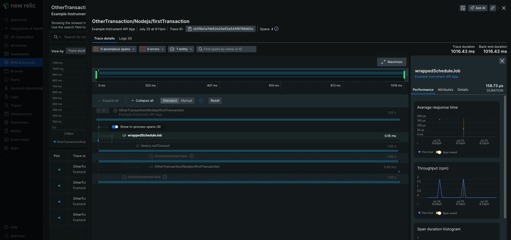

# Example instrumentation of a basic app

This example application shows you how to use the [newrelic.instrument](https://newrelic.github.io/node-newrelic/API.html#instrument) and associated [shim](https://newrelic.github.io/node-newrelic/Shim.html) API. It instruments a simple module, a rudimentary job queue (`jobQueue`), and runs a series of basic jobs.

## Getting Started

1. Clone or fork this repository.
2. Navigate to this example's sub directory
   ```
   cd newrelic-node-examples/custom-instrumentation/instrument
   ```
3. Install dependencies and run application.
   ```
   npm install
   cp env.sample .env
   # Fill out `NEW_RELIC_LICENSE_KEY` in .env and save 
   # Start the application
   npm start
   ```
4. The app will automatically start adding example jobs to a queue and run them. You should see the following in the console when the instrumentation takes place.
   ```
   [NEWRELIC] instrumenting 'job-queue'
   [NEWRELIC] instrumenting method 'scheduleJob'
   [NEWRELIC] instrumenting method 'runJobs'
   Callback job done
   Promise job done
   ```

## Exploring Telemetry

1. Now you should be able to see `job-queue` instrumented in New Relic. Navigate to 'APM & Services' and then select the 'Example Instrument API App' entity.
2. Then select 'Distributed tracing'. You should see the trace groups `firstTransacation` and `secondTransaction`. Inside these groups will be our custom instrumentation. Select any group and then select a single trace.
3. Toggle 'Show in-process spans' and you will see 'wrappedScheduleJob' which is the custom intrumentation of `job-queue` that we implemented.

   

## Description

This application consists of the following files:

* `index.js`: a simple app that schedules jobs and runs them
* `job-queue.js`: an example module that provides the queue class
* `instrumentation.js`: all of the New Relic instrumentation is in here; the `npm start` command makes sure this module is loaded first
* `newrelic.js`: a basic, sample New Relic configurartion
