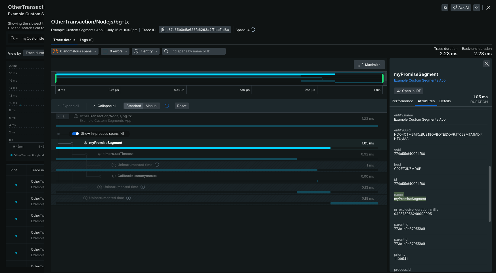
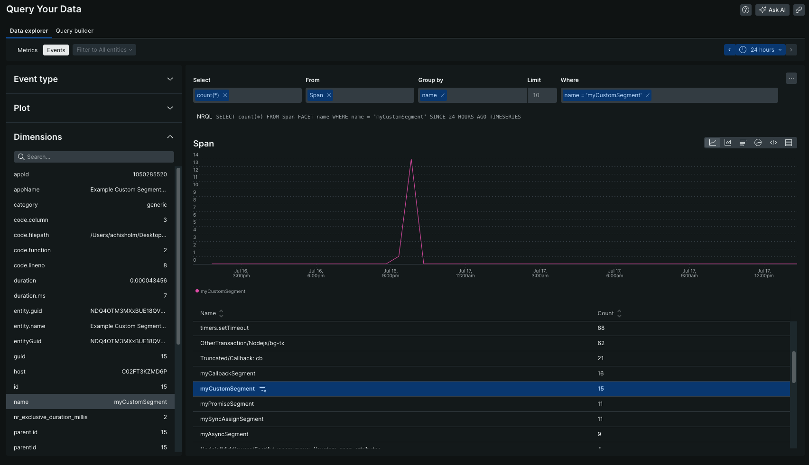

# Sample Custom Segments Application

This example provides an application with custom segments. Segments are a way to further break apart the different steps of a transaction and see the stats about that specific piece of code.

## Getting Started

1. Clone or fork this repository.
2. Navigate to this example's sub directory
   ```
   cd newrelic-node-examples/custom-instrumentation/segments
   ```
3. Install dependencies and run application.
   ```
   npm install
   cp env.sample .env
   # Fill out `NEW_RELIC_LICENSE_KEY` in .env and save 
   # Start the application
   npm start
   ```
4. Make requests to the application. Route names include: 'callback-segment', 'promise-segment', 'async-segment', and 'sync-assign-segment'.
   ```
   curl -X POST http://localhost:3000/custom-segment
   ```

## Exploring Telemetry

After sending a few requests, navigate to your application in APM & Services. Locate the 'Example Custom Segments App' service and then select 'Distributed tracing' on the left side of your screen. Then, select one of the trace groups that will contain your custom segment and select a single trace. If you expand the transaction (click 'Show in-process spans'), you should see your custom segment. Click on it to see its details.



To query your segment data, you can run a query like the following:›

```NRQL
SELECT count(*) FROM Span FACET name WHERE name = 'myCustomSegment'
```


