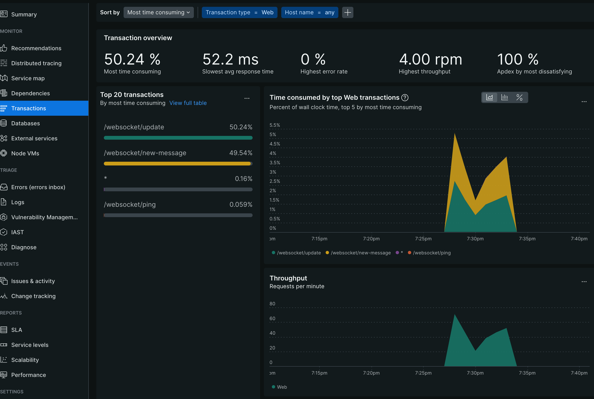
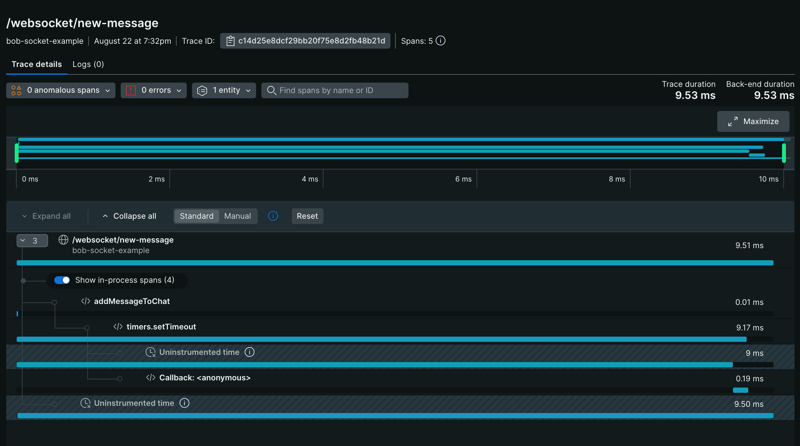

# Sample Start Web Transactions Application
This example demonstrates how to wrap server code in [startWebTransaction](https://newrelic.github.io/node-newrelic/API.html#startWebTransaction) to record custom web transactions.  This wraps [socket.io](https://github.com/socketio/socket.io) events in web transactions and records custom segments for the work.  It also contains a [socket.io](https://github.com/socketio/socket.io) client that interacts with the web socket server.

## Getting Started

1. Clone or fork this repository.
2. Navigate to this example's sub directory
   ```
   cd newrelic-node-examples/custom-instrumentation/start-web-transaction
   ```
3. Install dependencies and run application.
   ```
   npm install
   cp env.sample .env
   # Fill out `NEW_RELIC_LICENSE_KEY` in .env and save 
   # Start the application
   npm start
   npm run client
   ```

## Exploring Telemetry
After running both the server and client, navigate to your application in APM & Services. Locate the 'Example Start Web Transaction App' service and then select Transactions on the left-side of the screen. You should see your requests in a few minutes in a similar fashion to below.



To see a breakdown of a transaction, navigate to `Distributed Tracing`. Open a trace group for `/websocket/new-message`.  You should see the custom segment as well as a full breakdown of the trace.

