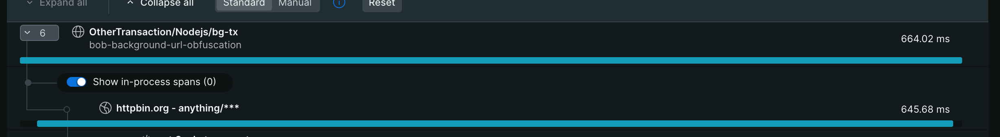
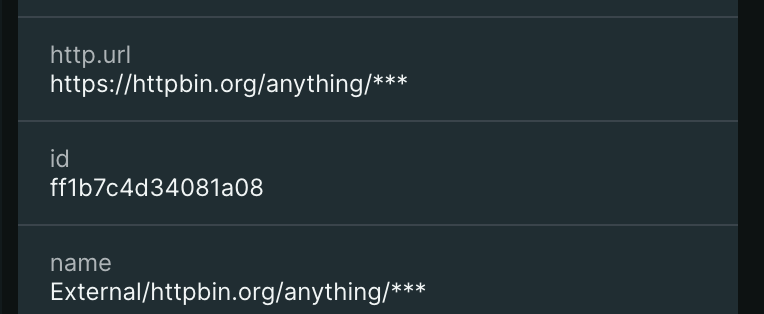

# Sample URL Obfuscation Application 

This example provides an application that applies a url obfuscation rule to scrub email adddresses from external http calls using `fetch`. 

## Getting Started

1. Clone or fork this repository.
2. Navigate to this example's sub directory
   ```
   cd newrelic-node-examples/custom-instrumentation/url-obfuscation
   ```
3. Install dependencies and run application.
   ```
   npm install
   cp env.sample .env
   # Fill out `NEW_RELIC_LICENSE_KEY` in .env and save 
   # Start the application
   npm start
   ```
4. The application will make a call to `https://httpbin.org/anything/myemail@domain.com` 
5. It will apply the url obfuscation rules from newrelic.js

```js
  url_obfuscation: {
    enabled: true,
    regex: {
      pattern: '[\\w-\\.]+@([\\w-]+\\.)+[\\w-]{2,4}',
      replacement: '***'
    }
  }
```

6. This will obfuscate the email address from both the span name and the `http.url` span attribute.

This shows the span name obfuscates the email from the span name:

   


This shows the `http.url` span attribute obfuscates the email:

   

