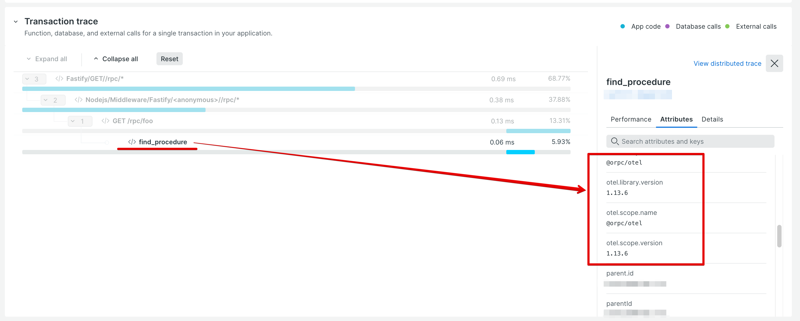

# OpenTelemetry Example Application

This is an example app that uses the
[New Relic agent](https://github.com/newrelic/node-newrelic) in the
OpenTelemetry bridge mode to utilize the `@orpc/otel` module.

## Setup

**Note**: This is used to demonstrate behavior of the New Relic Node.js
agent with the OpenTelemetry bridge enabled.

Requirements:
  + Node.js >= 20.6.0


```sh
npm install
cp env.sample .env
# Fill out `NEW_RELIC_LICENSE_KEY`
npm start
```

Issue requests to the server:

```sh
curl 127.0.0.1:3000/rpc/foo
```

Wait for the data to be processed, and your dashboard should show that
the `@orpc/otel` module has instrumented the application:


