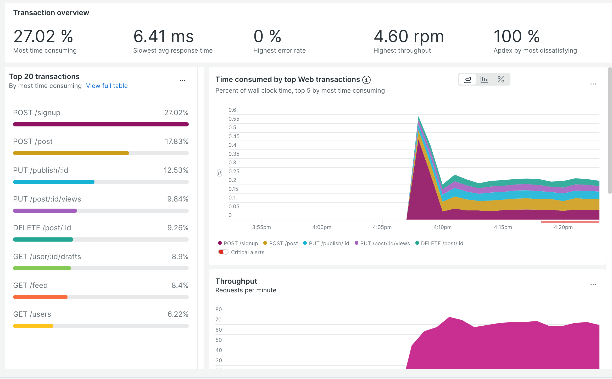
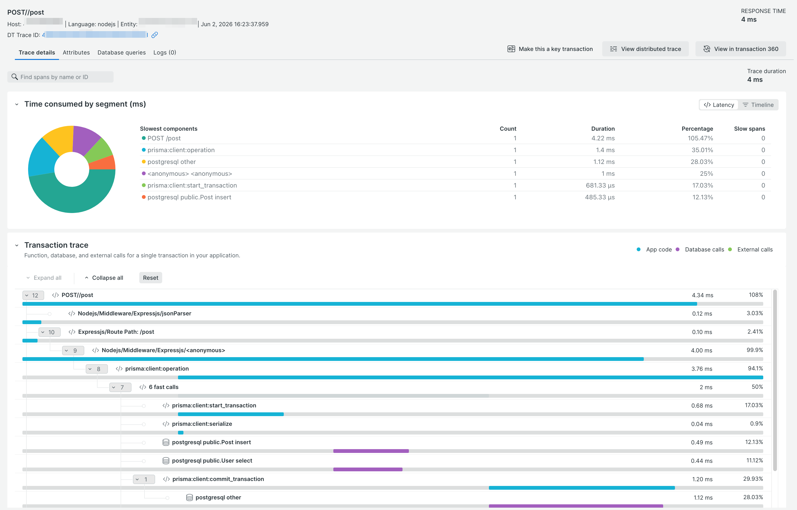

This is an example of an instrumented Prisma app, originally based on
code from
https://github.com/prisma/prisma-examples/tree/663c23ca1a6c6f03d2ad0c67868020b560a172e4/orm/express.

This app shows how to use the JavaScript variant of Prisma 7 with the
New Relic agent in order to gain insight into the operations of Prisma. This
requires at least version 14.1.0 of the New Relic Node.js agent.

To run the example:

1. Copy `sample.env` to `.env`.
1. Edit `.env` to add your New Relic ingest key, and any other desired changes.
Remember: the data will be associated with the app named by `NEW_RELIC_APP_NAME`.
1. Start with `docker compose up -d`.
1. Use the helper script in the container to make requests to the application:
`docker exec -i prisma-7-js-app-1 bash -c './make-requests.sh'`.
1. Stop the app with `docker compose down`.
1. Remove the built image with `docker image rm prisma-example`.

  
Transaction Overview Dashboard Example (🖼️)

  

  
Request Trace Detail Dashboard Example (🖼️)

  

## Details

Important details to review in this repository are:

1. `app/prisma/schema.prisma`: specifically the provider used.
1. `app/prisma-config.js`: shows how to configure `prisma@7`.
1. `app/package.json`: the dependencies lists shows required dependencies. The
`dev` script shows how an application should be launched. Note that the
order of the `-r` scripts is important. The New Relic agent should be loaded
before the OpenTelemetry script.
1. `app/otel-instrumentation.js`: this shows required setup for the
OpenTelemetry integration. 
1. `app/newrelic.js`: this shows which instrumentations must be disabled
for this example to work. Pay attention to the `instrumentation`
and `opentelemetry` sections.
